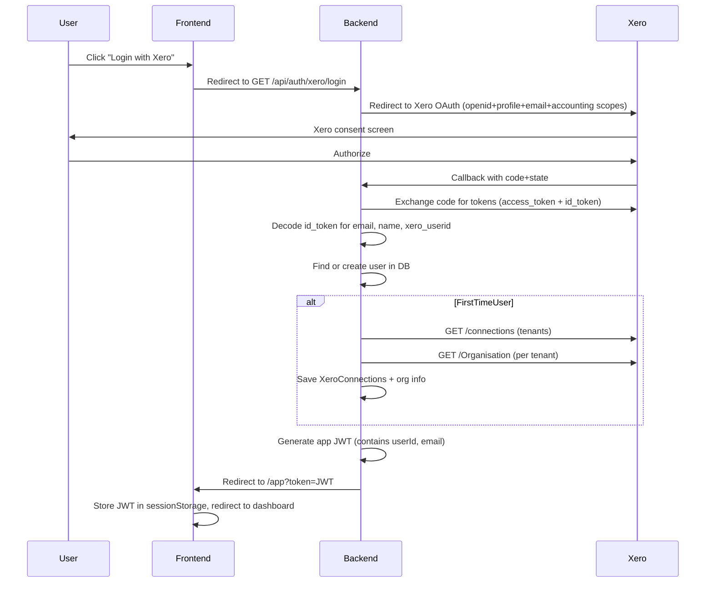

# Xero-Only Login Migration

## Current State

- **Supabase Auth** handles login (`signInWithPassword`), sessions (cookies via `@supabase/ssr`), password reset, and invite
- **Xero OAuth** is used only for connecting to Xero orgs (tenants), not for authentication
- The `users` table has a `supabase_user_id` column as the identity link
- ~15 frontend files reference `supabase.auth.`* or `createClient()`

## New Login Flow




## Changes by Layer

### 1. Backend: Xero OAuth scopes and login endpoint

`**[XeroConfig.java](backend/src/main/java/com/prepaidly/config/XeroConfig.java)**` -- Add OpenID Connect scopes (`openid`, `profile`, `email`) to `REQUIRED_SCOPES` so the token exchange returns an `id_token` with user info.

`**[XeroAuthController.java](backend/src/main/java/com/prepaidly/controller/XeroAuthController.java)**` -- Add a new `GET /api/auth/xero/login` endpoint (no `supabaseUserId` required). This generates the OAuth URL with a special "login" state marker and redirects the user to Xero.

### 2. Backend: Callback changes -- user creation and JWT

`**[XeroOAuthService.java](backend/src/main/java/com/prepaidly/service/XeroOAuthService.java)**` -- After exchanging the code for tokens, decode the `id_token` JWT to extract `email`, `given_name`, `family_name`, `xero_userid`. The project already has `jjwt` in `[build.gradle](backend/build.gradle)`. No signature verification needed for the id_token from Xero's token endpoint (received server-to-server over HTTPS).

`**[XeroAuthController.java](backend/src/main/java/com/prepaidly/controller/XeroAuthController.java)**` -- Modify the callback to:

- Detect "login" flow vs "connect additional org" flow from the state
- For login: find user by `email` or `xero_user_id`, create if not found (first-time), set `display_name`, `last_login`
- For first-time users: proceed with the full Xero connection sync (tenants, org info) -- this is what the callback already does
- For returning users: skip the sync, just update `last_login`
- Generate a JWT containing `{ userId, email, name }` and redirect to `{frontendUrl}/app?token={jwt}`

### 3. Backend: Session validation

**New `JwtAuthService`** -- Create a service to generate and validate app JWTs. The project already has `jjwt` configured with `jwt.secret` in `[application.properties](backend/src/main/resources/application.properties)`.

`**[UserController.java](backend/src/main/java/com/prepaidly/controller/UserController.java)**` -- Update `/api/users/profile` to accept a JWT-based user ID instead of `supabaseUserId`. Add a `GET /api/auth/me` endpoint that validates the JWT and returns user info (used by the frontend on page load).

### 4. Backend: Deprecate Supabase Auth dependencies (keep files, stop using them)

- `**[SupabaseAdminService.java](backend/src/main/java/com/prepaidly/service/SupabaseAdminService.java)**` -- Add `@Deprecated` annotation. Stop calling it from `UserController`. Keep the file for now.
- `**[UserController.java](backend/src/main/java/com/prepaidly/controller/UserController.java)**` -- Mark `POST /api/users/sync-supabase` and `POST /api/users/activity` as `@Deprecated`. Remove calls to them from the active login flow. Update `GET /api/users/profile` to use `userId` from JWT.
- `**[PasswordResetService.java](backend/src/main/java/com/prepaidly/service/PasswordResetService.java)**` and `**[PasswordResetController.java](backend/src/main/java/com/prepaidly/controller/PasswordResetController.java)**` -- Add `@Deprecated` annotation. Keep files for now.
- `**[User.java](backend/src/main/java/com/prepaidly/model/User.java)**` -- Add `xero_user_id` column. Keep `supabase_user_id` in the model (it's in the DB) but stop using it in new code.
- `**[UserRepository.java](backend/src/main/java/com/prepaidly/repository/UserRepository.java)**` -- Add `findByXeroUserId(String)`. Mark Supabase-related methods as `@Deprecated`.

### 5. Frontend: Login page -- Xero-only

`**[login/page.tsx](frontend/app/auth/login/page.tsx)**` -- Replace the email/password form with a single "Login with Xero" button. Remove Supabase `signInWithPassword`. The button redirects to `{API_BASE_URL}/api/auth/xero/login`.

### 6. Frontend: Session management -- JWT instead of Supabase

`**[lib/api.ts](frontend/lib/api.ts)**` -- Replace `getSupabaseUser()` with a `getAuthToken()` function that reads the JWT from `sessionStorage`. Pass it as `Authorization: Bearer {token}` header on API calls. Add a `UserProfile` type derived from the JWT or `/api/auth/me` endpoint.

**New `lib/auth.ts`** -- Helper to:

- Extract JWT from URL on redirect (`/app?token=...`), store in `sessionStorage`
- `getUser()` -- decode JWT payload for user info
- `isAuthenticated()` -- check if valid JWT exists
- `signOut()` -- clear `sessionStorage` and redirect to login

### 7. Frontend: Replace all Supabase session checks

The following files call `supabase.auth.getSession()` to guard pages. Replace with the new `isAuthenticated()` check:

- `[app/app/page.tsx](frontend/app/app/page.tsx)`
- `[components/DashboardLayout.tsx](frontend/components/DashboardLayout.tsx)` (session + signOut)
- `[app/app/schedules/[id]/page.tsx](frontend/app/app/schedules/[id]/page.tsx)`
- `[app/app/system-log/page.tsx](frontend/app/app/system-log/page.tsx)`

### 8. Frontend: Deprecate Supabase-only pages (keep files, mark as deprecated)

These pages are Supabase-specific and no longer used with Xero login. Add a `@deprecated` comment at the top of each file and a visible deprecation banner in the UI. Do **not** delete yet -- remove after verifying the new login flow works.

- `[app/auth/forgot-password/page.tsx](frontend/app/auth/forgot-password/page.tsx)` -- mark deprecated
- `[app/auth/reset-password/page.tsx](frontend/app/auth/reset-password/page.tsx)` -- mark deprecated
- `[app/auth/accept-invite/page.tsx](frontend/app/auth/accept-invite/page.tsx)` -- mark deprecated
- `[app/auth/callback/route.ts](frontend/app/auth/callback/route.ts)` -- mark deprecated

### 9. Frontend: Deprecate Supabase client libraries (keep for now)

- `[lib/supabase/client.ts](frontend/lib/supabase/client.ts)` -- add `@deprecated` comment. Still imported by deprecated pages and Supabase Storage usage.
- `[lib/supabase/server.ts](frontend/lib/supabase/server.ts)` -- add `@deprecated` comment.
- Keep `@supabase/ssr` and `@supabase/supabase-js` in `[package.json](frontend/package.json)` -- still needed for Supabase Storage (invoice file uploads in `[schedules/new/page.tsx](frontend/app/app/schedules/new/page.tsx)` and `[schedules/[id]/edit/page.tsx](frontend/app/app/schedules/[id]/edit/page.tsx)`).

**Post-verification cleanup:** Once the new login flow is confirmed working, delete all deprecated files, remove unused Supabase auth deps, and drop `supabase_user_id` column.

### 10. Database migration

```sql
ALTER TABLE users ADD COLUMN IF NOT EXISTS xero_user_id VARCHAR(255) UNIQUE;
CREATE INDEX IF NOT EXISTS idx_users_xero_user_id ON users(xero_user_id);
```

### 11. Frontend: Update `xeroAuthApi` in `lib/api.ts`

- `getConnectUrl()` -- Remove `supabaseUserId` param; pass JWT token instead (or use the `Authorization` header on a new endpoint)
- `getStatus()`, `disconnect()` -- Same: remove `supabaseUserId`, use JWT-based auth
- Remove `usersApi.syncSupabase()` and `usersApi.recordActivity()`
- Update `usersApi.getProfile()` to use JWT auth instead of `supabaseUserId` query param

## Key Design Decisions

- **JWT for sessions** -- Stateless, simple. The JWT secret already exists in config. JWT is stored in `sessionStorage` (cleared on tab close). For persistent sessions, consider `localStorage` or HTTP-only cookies in a follow-up.
- **First-time vs returning user** -- Determined by whether a `users` row with matching `xero_user_id` or `email` already exists. First-time triggers full Xero sync; returning just updates `last_login`.
- **No passwords** -- No password reset, forgot password, or invite flows needed. All auth goes through Xero.
- **Supabase database stays** -- Only the Auth layer is removed. The PostgreSQL database on Supabase continues to be used.

